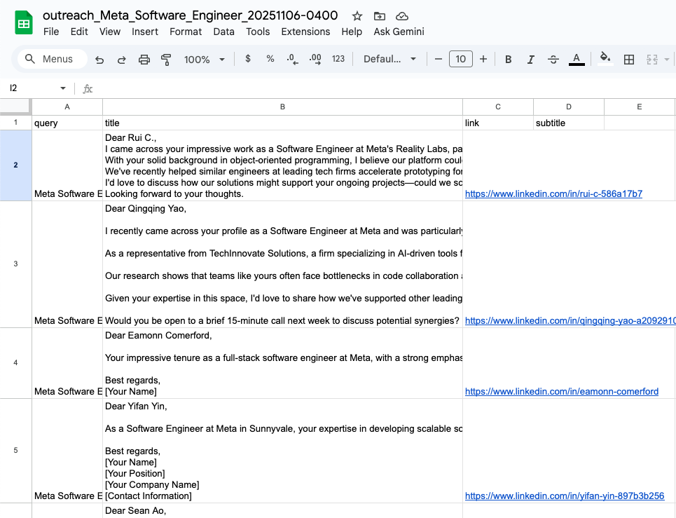

# 📨 OutreachAuto

**OutreachAuto** is an AI-powered lead generation and outreach assistant built with **Django**.  
It allows users to search by **company**, **job title**, or **keyword**, and automatically generates **personalized outreach messages** for relevant LinkedIn profiles. Each result includes a **direct profile link** and can be **downloaded as a CSV** for export or CRM integration.

---

## 🌟 Overview

OutreachAuto combines web search, AI-generated personalization, and a clean, intuitive interface to simplify your prospecting workflow.

**In one step, you can:**
1. Search for professionals by role or company (e.g., _"Meta Software Developer"_).
2. Automatically fetch public LinkedIn profiles via **SerpAPI**.
3. Generate **customized outreach messages** using your integrated AI function.
4. View results in a responsive UI.
5. Export everything to a CSV for downstream use in HubSpot, Salesforce, or your email sequences.

---

## 🎯 Core Features

| Feature | Description |
|----------|--------------|
| 🔍 **Smart Search** | Enter any keyword, company, or job title (e.g., `Data Scientist at OpenAI`). |
| 💬 **AI Outreach Message Generation** | Creates context-aware, personalized messages based on each LinkedIn profile’s info. |
| 🔗 **Profile Links** | Each result includes a verified `linkedin.com/in/...` link. |
| 📥 **CSV Export** | One-click CSV download of all generated messages and profiles. |
| 🧭 **Responsive UI** | Search bar centers on load, moves to top after search; results display in floating cards. |
| ⚙️ **Plug-and-Play Backend** | Built on Django 5 with modular Python logic (`outreach.py`, `views.py`). |
| 🔒 **Environment Variables** | `.env`-based configuration for SerpAPI keys, Django settings, and security. |

---

## 🧠 How It Works

1. **User enters a query** like `Snowflake Data Engineer`.
2. The backend constructs a **Google search** using SerpAPI:
3. The JSON results are parsed to extract LinkedIn profile links and snippets.
4. Each snippet is passed into your **LLM** (`query_llm()`) to generate a **customized outreach message**.
5. The messages and links are returned to the browser and displayed in elegant cards.
6. The user can then **download** the current batch as a CSV.

---

## 💼 Potential Use Cases

### 🧑‍💼 Sales & Business Development
- Generate first-touch outreach messages for leads at target accounts.
- Download messages for review, personalization, or CRM upload.

### 🤖 Recruiting
- Search by job title or company to find potential hires.
- Generate AI-personalized recruiter messages for outreach.

### 📊 Marketing & Partnerships
- Quickly identify contacts for collaboration or sponsorship opportunities.
- Export data for enrichment and follow-up.

### 🧪 Research & Data Collection
- Build datasets of professionals in certain domains.
- Generate qualitative outreach templates for surveys or studies.

### 💡 Startup Founders
- Rapidly prospect early adopters and investors.
- Use it as a prototype for AI-driven CRM automation.

---

## 🚀 Quickstart

```bash
# 0) clone
git clone https://github.com/rtphawaii/OutreachAuto.git
cd OutreachAuto

# 1) venv + install
python -m venv .venv
source .venv/bin/activate
pip install -r requirements.txt

# 2) environment variables
cp .env.example .env     # (create one if example not present)
# edit .env and set SERP_API_KEY and DJANGO_SECRET_KEY, see below

# 3) run
python manage.py migrate
python manage.py runserver
# open http://127.0.0.1:8000
```

---

## Demo: 

[demo video here](https://vimeo.com/1134091407?share=copy&fl=sv&fe=ci)

1. Search your company and title

2. See the results and save to .csv

3. View the .csv



